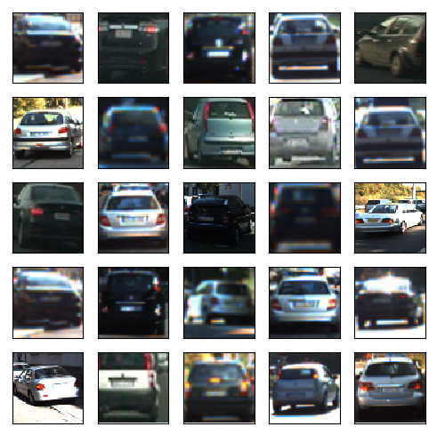
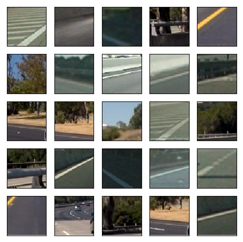
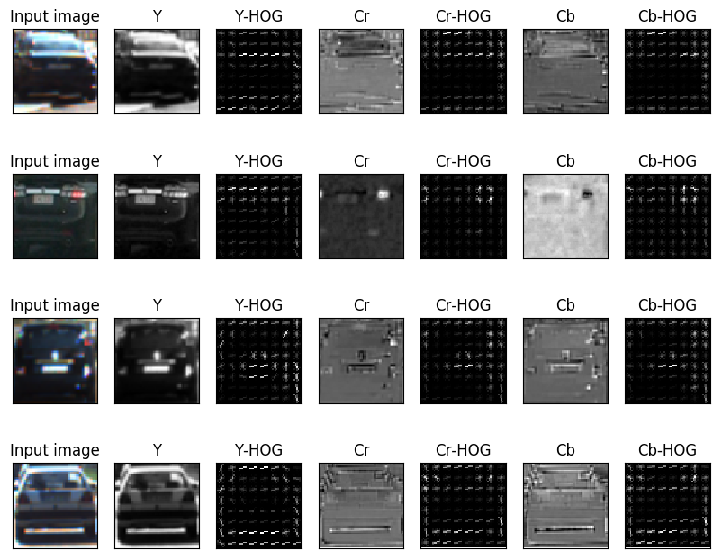
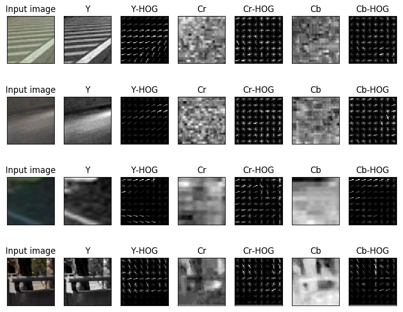
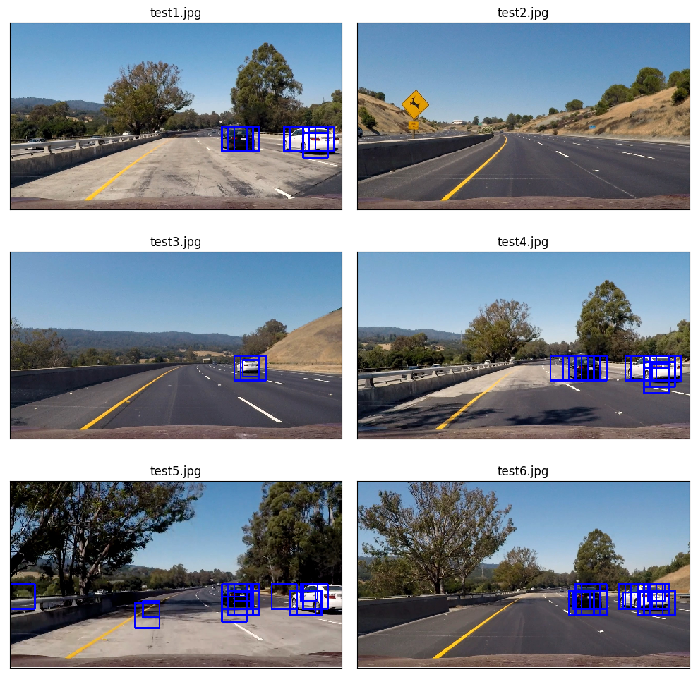
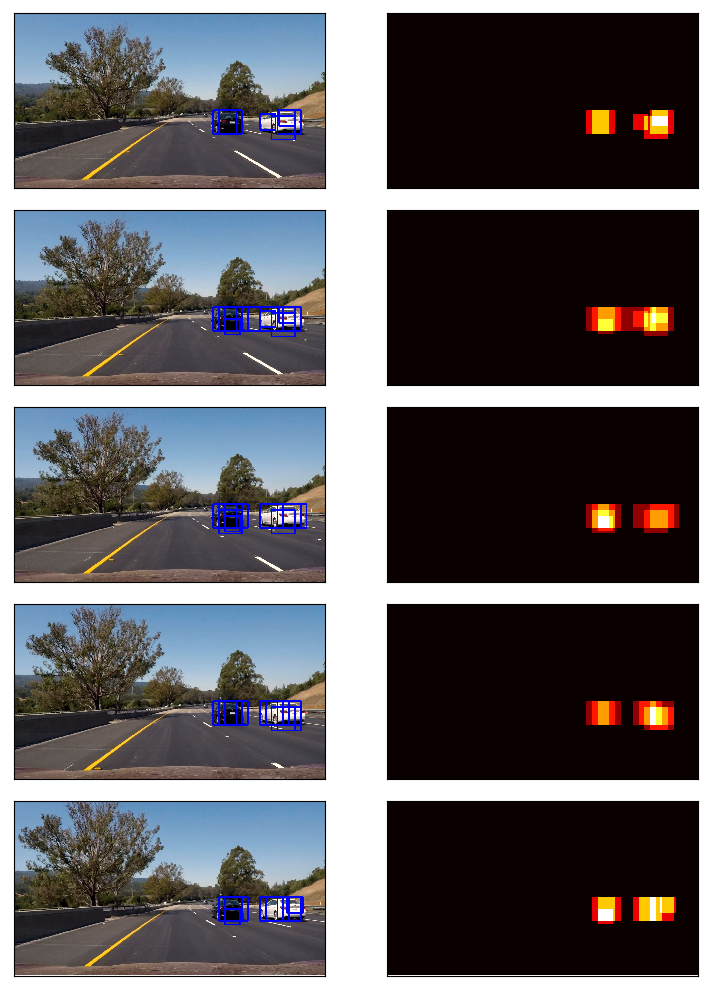
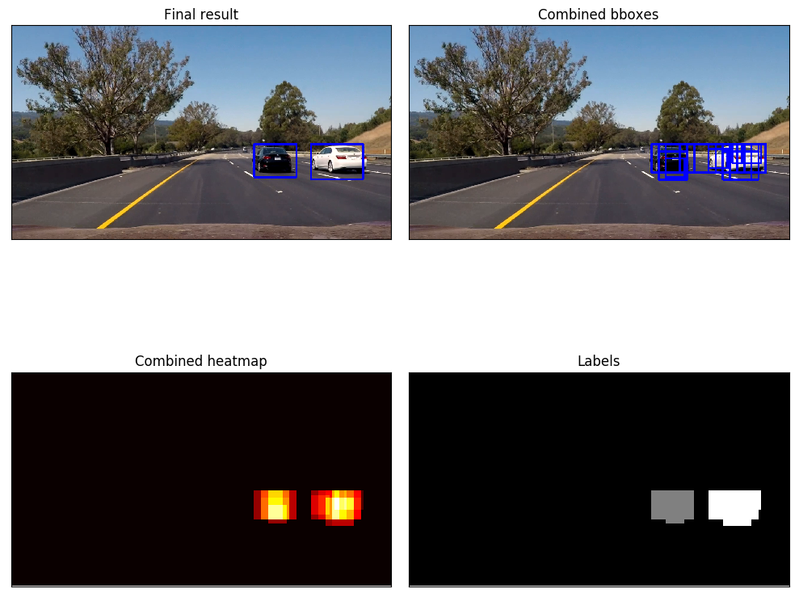

## Vehicle Detection Project

The goals / steps of this project are the following:

* Perform a Histogram of Oriented Gradients (HOG) feature extraction on a labeled training set of images and train a classifier Linear SVM classifier
* Optionally, you can also apply a color transform and append binned color features, as well as histograms of color, to your HOG feature vector.
* Note: for those first two steps don't forget to normalize your features and randomize a selection for training and testing.
* Implement a sliding-window technique and use your trained classifier to search for vehicles in images.
* Run your pipeline on a video stream (start with the test_video.mp4 and later implement on full project_video.mp4) and create a heat map of recurring detections frame by frame to reject outliers and follow detected vehicles.
* Estimate a bounding box for vehicles detected.

## [Rubric](https://review.udacity.com/#!/rubrics/513/view) Points
### Here I will consider the rubric points individually and describe how I addressed each point in my implementation.  

---
### Writeup / README

#### 1. Provide a Writeup / README that includes all the rubric points and how you addressed each one.  You can submit your writeup as markdown or pdf.  [Here](https://github.com/udacity/CarND-Vehicle-Detection/blob/master/writeup_template.md) is a template writeup for this project you can use as a guide and a starting point.  

You're reading it!

### Histogram of Oriented Gradients (HOG)

#### 1. Explain how (and identify where in your code) you extracted HOG features from the training images.

The code for training the car classifier is contained the file `train.py`.  

I started by reading in all the `vehicle` and `non-vehicle` images.  Here is an example of one of each of the `vehicle` and `non-vehicle` classes:

I then explored different color spaces and different `skimage.hog()` parameters (`orientations`, `pixels_per_cell`, and `cells_per_block`).  I grabbed random images from each of the two classes and displayed them to get a feel for what the `skimage.hog()` output looks like.

Here is an example using the `YCrCb` color space and HOG parameters of `orientations=9`, `pixels_per_cell=(8, 8)` , `cells_per_block=(2, 2)` and `hog_cannel='ALL'`:

#### 2. Explain how you settled on your final choice of HOG parameters.

I tried various combinations of parameters and found out the combination above gave me the best classification accuracy on the test set.

#### 3. Describe how (and identify where in your code) you trained a classifier using your selected HOG features (and color features if you used them).

I trained a linear SVM using `svc = sklearn.svm.LinearSVC()`. I first stack input features and labels from all images. Then I normalize the features and shuffle the data. I use `sklearn.model_selection.train_test_split` to split the data into training set and test set. Finally the classifier is trained using `svc.fit()` function. The reported test accuracy using `svc.score()` is 98.17%.

### Sliding Window Search

#### 1. Describe how (and identify where in your code) you implemented a sliding window search.  How did you decide what scales to search and how much to overlap windows?

The code for the sliding window search is in the file `detect.py`. The bounding boxes are found using the sliding window approach in function `find_cars` which returns the bounding boxes that contains cars. I tried various scales for the bounding box and found out the combination of scale 1.0 and 1.5, and a overlapping cell size 2 works well. The raw detection result (bounding boxes on top of the original image) for test images are shown below.

#### 2. Show some examples of test images to demonstrate how your pipeline is working.  What did you do to optimize the performance of your classifier?

Ultimately I searched on two scales using YCrCb 3-channel HOG features, which provided a nice result.  Here are some example images:

---

### Video Implementation

#### 1. Provide a link to your final video output.  Your pipeline should perform reasonably well on the entire project video (somewhat wobbly or unstable bounding boxes are ok as long as you are identifying the vehicles most of the time with minimal false positives.)
Here's a [link to my video result](./result_project_video.mp4)

#### 2. Describe how (and identify where in your code) you implemented some kind of filter for false positives and some method for combining overlapping bounding boxes.

I recorded the positions of positive detections in each frame of the video.  From the positive detections I created a heatmap and then thresholded that map to identify vehicle positions.  I then used `scipy.ndimage.measurements.label()` to identify individual blobs in the heatmap.  I then assumed each blob corresponded to a vehicle.  I constructed bounding boxes to cover the area of each blob detected.  

Here's an example result showing the heatmap from a series of frames of video (extracted from *test_video.mp4*).

The result of `scipy.ndimage.measurements.label()` and the bounding boxes then overlaid on the last frame of sequence:

---

### Discussion

#### 1. Briefly discuss any problems / issues you faced in your implementation of this project.  Where will your pipeline likely fail?  What could you do to make it more robust?

I didn't have enough time to further improve the result. But from the result I submitted, I can see that the bounding boxes are not so robust. There are still some false positives, the detected bounding boxes are a bit jittering. And sometimes when there is a car occluded by another car, the final filtered bounding box can not separate the two.

Another problem is that the computation speed. Even though I only used HOG features on 'YCrCb' channels and did not use spatial features and color histogram features. The pipeline takes about half second for a single image detection, this is too slow for real time application.

Here are some possible improvement that I would do to further improve the result:

- Further investigate the feature spaces to improve the classification performance.

- Maybe consider using a different classifier.

- Consider shrink the image size for speed. Detect directly on 720p images is kinda overkill.

- Use a Kalman filter for target tracking.

- Consider totally difference and modern deep learning approaches like R-CNN, or YOLO.
